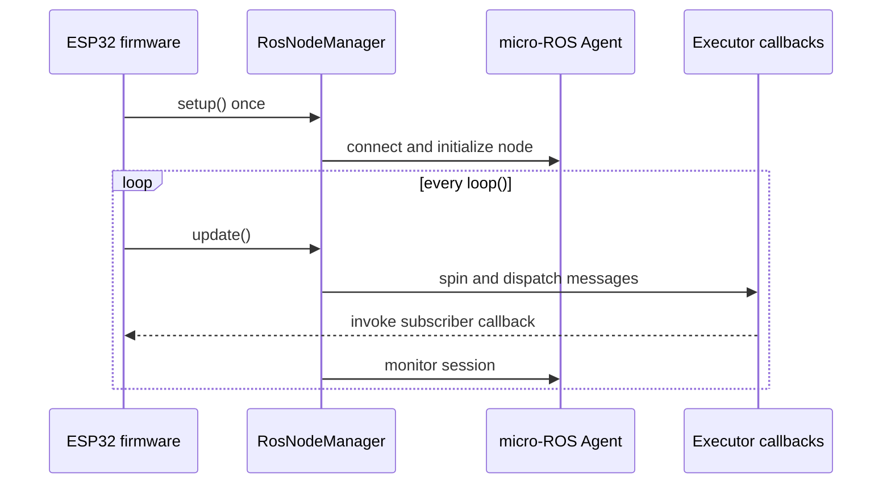

# Arduino-ROS

Arduino-ROS provides shared micro-ROS lifecycle, publishers, subscribers, and robot message helpers for ESP32 Arduino firmware. It is used by both Indoor and Outdoor robots; robot-specific pin assignments, speed limits, and calibration remain in firmware.

[Doxygen API reference](https://nono-robotics.github.io/arduino-ros/) · [Coverage report](https://nono-robotics.github.io/arduino-ros/coverage/) · [License](LICENSE)

## Contents

- [Requirements and installation](#requirements-and-installation)
- [How a node runs](#how-a-node-runs)
- [Transport configuration](#transport-configuration)
- [API overview](#api-overview)
- [Examples](#examples)
- [Build and tests](#build-and-tests)
- [Troubleshooting](#troubleshooting)

## Requirements and installation

- ESP32, Arduino framework, PlatformIO, and a ROS 2 Humble micro-ROS Agent reachable over configured Wi-Fi or serial transport.
- PlatformIO micro-ROS integration compatible with the selected ESP32 board and transport.
- `arduino-commons` is a dependency for shared data types, sensors, and motor utilities. PlatformIO resolves declared library dependencies; if configuring dependencies manually, add both libraries.

Example `platformio.ini` (adapt board and transport settings to the firmware):

```ini
[env:esp32dev]
platform = espressif32
board = esp32dev
framework = arduino
board_microros_distro = humble
lib_deps =
  https://github.com/adrianmarino/arduino-ros
```

Configure the micro-ROS Agent endpoint and the `board_microros_transport` setting for your PlatformIO micro-ROS package. The Wi-Fi example below also enables this library's `USE_WIFI_TRANSPORT` path.

## How a node runs

Create and initialize the node once in `setup()`. Create publishers and subscribers after `setup()` has initialized the node and executor. Call `update()` on every pass through `loop()` so incoming callbacks run and connection health is monitored.



`setup()` returns the same manager pointer for convenient chaining. Its first connection is bounded; a missing Agent or lost connection can cause the ESP32 to restart, as documented in [`RosNodeManager`](include/RosNodeManager.h). Do not add blocking delays to `loop()`; call `update()` frequently.

## Transport configuration

### Wi-Fi

Configure PlatformIO transport and define the Wi-Fi build flag. `RosNodeManager` uses the Wi-Fi connection manager and configuration portal.

```ini
board_microros_transport = wifi
build_flags = -DUSE_WIFI_TRANSPORT
```

### Serial

Use the PlatformIO micro-ROS serial transport and omit `USE_WIFI_TRANSPORT`. Set the Agent-side serial connection and baud rate consistently with firmware; manager default baud rate is `921600`.

## API overview

| Area | Types | Role |
|---|---|---|
| Lifecycle | `RosNodeManager` | Owns node, allocator, executor, connection checks, optional clock sync |
| Basic publishers | `StringPublisher`, `IntPublisher`, `FloatPublisher`, `FloatArrayPublisher` | `std_msgs` string, integer, float, and float-array messages |
| Sensor publishers | `IMUPublisher`, `GPSPublisher` | `sensor_msgs/Imu` and `sensor_msgs/NavSatFix` |
| Motion input | `RosTwistSubscriber` | Receives `geometry_msgs/Twist` commands, commonly `/cmd_vel` |
| Wheel feedback input | `WheelSpeedsSubscriber` | Validates six-element `Float32MultiArray` and provides typed `WheelSpeeds` |
| Odometry | `DifferentialRobotOdometryPublisher`, `Vector3StampedPublisher` | Publishes odometry state or stamped vectors |
| Utilities | `Logger`, `MicroRosTimeUtils` | Serial/ROS logging and Agent time synchronization |

`ArduinoRos.h` is the umbrella include for most APIs. Include `WheelSpeedsSubscriber.h` explicitly; that header is not currently included by the umbrella. `WheelSpeedsSubscriber` accepts exactly six finite float values, in order: left average, right average, front-left, front-right, back-left, back-right. Its fault callback runs on null, wrong-size, or non-finite input. The `WheelSpeeds` type comes from `arduino-commons` and uses rad/s.

ROS graph ownership flows one direction: firmware creates ROS entities from the initialized node/executor; callbacks update application state; `loop()` services the executor.

## Examples

### Minimal lifecycle and `/cmd_vel` subscriber

This example only records the latest command. Connect a calibrated controller before applying commands to a real robot.

```cpp
#include <Arduino.h>
#include "ArduinoRos.h"

RosNodeManager nodeManager("robot_node");
RosTwistSubscriber *twistSub;
volatile float targetLinearMps = 0.0F;
volatile float targetAngularRadps = 0.0F;

void onCmdVel(geometry_msgs__msg__Twist *twist) {
  if (twist == nullptr) return;
  targetLinearMps = twist->linear.x;
  targetAngularRadps = twist->angular.z;
}

void setup() {
  nodeManager.setup();
  twistSub = new RosTwistSubscriber(
      nodeManager.getNode(), nodeManager.getExecutor(), "/cmd_vel", onCmdVel);
}

void loop() {
  nodeManager.update();
  // Use latest targets in nonblocking control logic.
}
```

The subscriber stores callback registration internally. Keep the subscriber alive for the node lifetime. In application firmware, keep all entity creation in `setup()` and use project ownership conventions for its lifetime; never allocate publishers/subscribers per message or per loop iteration.

### Basic publisher

The publisher adapter wraps a `MicroRosPublisher`; construct both once after node setup. Use a timer or elapsed-time check to control publish rate without blocking executor servicing.

```cpp
#include <Arduino.h>
#include "ArduinoRos.h"

RosNodeManager nodeManager("status_node");
FloatPublisher *batteryPublisher;
uint32_t lastPublishMs = 0;

void setup() {
  nodeManager.setup();
  batteryPublisher = new FloatPublisher(
      MicroRosPublisher::createFloat(nodeManager.getNode(), "/battery/voltage"));
}

void loop() {
  nodeManager.update();
  const uint32_t now = millis();
  if (now - lastPublishMs >= 1000) {
    lastPublishMs = now;
    batteryPublisher->publish(12.4F); // Replace with measured voltage.
  }
}
```

`MicroRosPublisher::createInt`, `createFloat`, `createFloatArray`, and `createString` accept node, topic, optional minimum interval in milliseconds, and optional reliable-QoS flag. `StringPublisher` and `FloatArrayPublisher` own message memory; keep them alive as long as they publish.

### IMU and GPS publishing

Pass the initialized allocator and node. Populate data using the shared `IMUData`/`GPSData` contract from `arduino-commons`; sensor driver units and covariance must reflect the actual sensor configuration.

```cpp
#include <Arduino.h>
#include "ArduinoRos.h"

RosNodeManager nodeManager("sensor_node");
IMUPublisher *imuPublisher;
GPSPublisher *gpsPublisher;
IMUData imuData;
GPSData gpsData;

void setup() {
  nodeManager.setup();
  imuPublisher = new IMUPublisher(nodeManager.getNode(),
                                 nodeManager.getAllocator(), "/imu/data", "imu_link");
  gpsPublisher = new GPSPublisher(nodeManager.getNode(),
                                  nodeManager.getAllocator(), "/gps/fix", "gps_link");
}

void loop() {
  nodeManager.update();
  // Poll sensors without blocking, then publish when each has a fresh sample.
  // imuPublisher->publish(&imuData);
  // gpsPublisher->publish(&gpsData);
}
```

### Differential-drive state publication

`DifferentialRobotOdometry` is a state value defined by the dependency library, not an integration routine that accepts `x/y/theta`. Update it with the four wheel angular speeds, then publish that state.

```cpp
#include <Arduino.h>
#include "ArduinoRos.h"

RosNodeManager nodeManager("wheel_node");
DifferentialRobotOdometryPublisher *odomPublisher;
DifferentialRobotOdometry odometry;
FourWheelAngularSpeed wheelSpeeds;

void setup() {
  nodeManager.setup();
  odomPublisher = new DifferentialRobotOdometryPublisher(
      nodeManager.getNode(), "/wheel/odometry", "base_link");
}

void loop() {
  nodeManager.update();
  // Replace values with encoder measurements in rad/s.
  wheelSpeeds.updateFrom(1.0F, 1.0F, 1.0F, 1.0F);
  odometry.updateFrom(wheelSpeeds);
  odomPublisher->publish(odometry);
}
```

### Wheel-speed subscription

The source topic must publish a six-element `std_msgs/msg/Float32MultiArray` with the ordering documented above. Subscriber currently dispatches through a single static instance; use one instance per firmware process.

```cpp
#include <Arduino.h>
#include "ArduinoRos.h"
#include "WheelSpeedsSubscriber.h"

RosNodeManager nodeManager("movement_node");
WheelSpeedsSubscriber *wheelSpeedsSub;

void onWheelSpeeds(const WheelSpeeds &speeds) {
  // Values are angular velocities in rad/s.
  Serial.printf("left %.3f, right %.3f\n",
                speeds.getAverageLeftWInRad(), speeds.getAverageRightWInRad());
}

void onWheelSpeedFault() {
  // Treat malformed data as invalid feedback; safe response belongs to firmware.
}

void setup() {
  Serial.begin(115200);
  nodeManager.setup();
  wheelSpeedsSub = new WheelSpeedsSubscriber(
      nodeManager.getNode(), nodeManager.getExecutor(), "/wheel/speeds",
      onWheelSpeeds, onWheelSpeedFault);
}

void loop() {
  nodeManager.update();
}
```

The `RosNodeManager` constructor's arguments differ when `USE_WIFI_TRANSPORT` is defined because Wi-Fi options precede the common arguments. Prefer defaults unless firmware has concrete reason to configure executor capacity or timing; ensure capacity covers every registered subscription.

## Build and tests

Compile the included PlatformIO example:

```sh
cd examples/basic_test
pio run
```

Run host-native regression tests (mock-backed; no ESP32 hardware or live Agent):

```sh
pio test -e native
commands/regression-test
```

The regression command prints coverage and creates `coverage/index.html`. Native tests do not validate transport connectivity, ROS graph interoperability, electrical IO, or sensor/motor integration; validate these on the intended hardware before deployment.

## Troubleshooting

| Symptom | Check |
|---|---|
| Node never connects | Agent running/reachable, transport setting, Wi-Fi portal or serial device/baud |
| Callback never runs | Topic name and message type match, executor has enough handles, `update()` runs continuously |
| Node restarts | `RosNodeManager` connection watchdog; inspect Agent and transport logs |
| Build cannot find message/type headers | Confirm `board_microros_distro`, PlatformIO micro-ROS package, and dependency installation |
